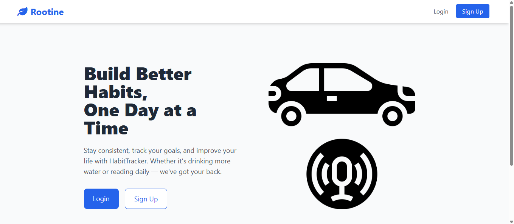

# 🧠 Rootine

A simple Django-based habit tracker that helps users build consistency by tracking daily or weekly goals. Built using Django, Tailwind CSS, and SQLite.

---

## 🚀 Features

- ✅ Daily and Weekly habit tracking: Users can set habits to track either daily or weekly, depending on their goals.
- 📈 Automatic streak and progress calculation: Completed habits reset at the start of the next day or week, encouraging continued engagement.
- 📅 Task resets daily/weekly: The system tracks current and longest streaks based on how consistently users complete their habits.
- 🎨 Responsive UI with Tailwind CSS: The frontend is built with Tailwind CSS, ensuring a responsive and clean design out of the box.

---
### Screenshot:

---

## 🛠️ Tech Stack

- Python 3.x
- Django
- Tailwind CSS 
- SQLite (local development)

---

## 🧾 Requirements

- Python 3.9+
- Git
- Virtual environment tool (`venv` or `virtualenv`)

---

## 📥 Getting Started

Follow these steps to clone and run the project on your local machine:

### 1. Clone the repository

```bash
git clone https://github.com/osemenjoy/HABIT_TRACKER.git
cd HABIT_TRACKER
```

### 2. Set up a virtual environment

If you haven’t already created a virtual environment, you can do so with the following commands:

```bash
python3 -m venv .venv
source .venv/bin/activate  # For Mac/Linux
.venv\Scripts\activate     # For Windows
```

### 3. Install dependencies

Install the project dependencies listed in `requirements.txt`:

```bash
pip install -r requirements.txt
```


### 4. Create the `.env` file

This project uses a `.env` file to store sensitive information like the Django `SECRET_KEY`. You need to generate one yourself.

1. Create a new `.env` file:

   - **macOS/Linux:**
     ```bash
     touch .env
     ```

   - **Windows (Command Prompt):**
     ```cmd
     echo.>.env
     ```


2. **Generate a new Django `SECRET_KEY`:**

    You can generate a new `SECRET_KEY` using this Python command:

    ```bash
    python -c "from django.core.management.utils import get_random_secret_key; print(get_random_secret_key())"
    ```

3. **Add the generated key to your `.env` file:**

    ```env
    SECRET_KEY=your_generated_secret_key
    ```


### 5. Run migrations to create the database

```bash
python manage.py migrate
```

### 6. Create a superuser (admin)

```bash
python manage.py createsuperuser
```

### 7. Predefined Habits
This project ships with 5 predefined habits (both daily and weekly types) for testing and development.

To load the sample data:
```bash
python manage.py loaddata habit_data.json
```

### 8. Start the development server

```bash
python manage.py runserver
```

Visit [http://127.0.0.1:8000](http://127.0.0.1:8000) to view the app.

---


## 🚀 How to Use the App

1. **Start the development server**  
   Run the Django server with:

   ```bash
   python manage.py runserver
   ```

2. **Visit the App**  
   Open your browser and go to:  
   [http://127.0.0.1:8000](http://127.0.0.1:8000)

3. **Login**  
   Use your superuser credentials to log in.

4. **Create a Habit**  
   - On the top-right corner of the navigation bar, click the blue **"Create Habit"** button.
   - Fill out the form to define your new habit.
   - Submit the form to save it.

5. **Manage Your Habits**  
   - Next to each habit, click the **three-dot menu** to:
     - ✅ **Edit** the habit  
     - ❌ **Delete** the habit  
     - 📊 **View Analytics** to track your progress

---

